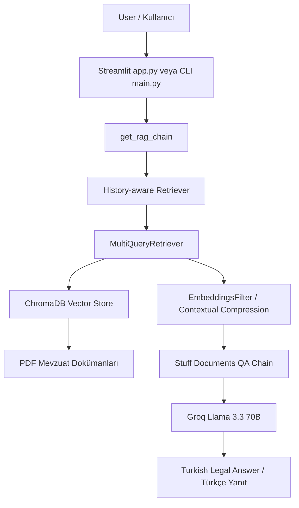
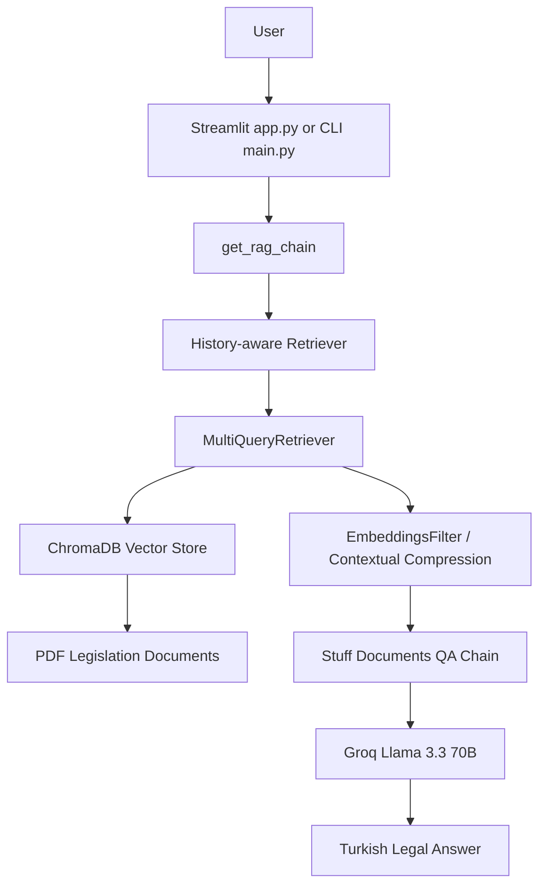

# ⚖️ Tüketici Hakları Asistanı

> Türkiye tüketici mevzuatı üzerine geliştirilmiş, PDF mevzuat dokümanlarından bağlam alarak Türkçe yanıt üreten RAG tabanlı yapay zeka asistanı.


---

## 📌 Proje Özeti

**Tüketici Hakları Asistanı**, kullanıcıların tüketici haklarıyla ilgili gündelik dilde sordukları soruları Türkiye tüketici mevzuatı dokümanlarına dayanarak yanıtlayan bir yapay zeka uygulamasıdır.

Proje, klasik bir sohbet botu yerine **RAG (Retrieval-Augmented Generation)** mimarisi kullanır. Yani model yanıt üretmeden önce `docs/` klasöründeki PDF mevzuat belgelerini vektör veritabanı üzerinden tarar, ilgili maddeleri bağlam olarak alır ve yanıtını bu bağlama göre oluşturur.

Uygulama özellikle şu tür sorular için tasarlanmıştır:

- İnternetten alınan ürünlerde cayma hakkı
- Ayıplı mal ve servis süreçleri
- Garanti belgesi ve satış sonrası hizmetler
- Taksitle satış, senet, bağlı kredi ve tüketici kredileri
- Mesafeli sözleşmeler ve e-ticaret yükümlülükleri
- Tüketici hakem heyeti başvuruları
- Fiyat etiketi, reklam, haksız ticari uygulamalar

> ⚠️ **Not:** Bu uygulama hukuki danışmanlık yerine geçmez. Yanıtlar, projeye eklenen mevzuat dokümanları ve sistem isteminde tanımlanan kurallar ile sınırlıdır.

---

## ✨ Temel Özellikler

- **RAG tabanlı mevzuat arama:** PDF dokümanları ChromaDB vektör veritabanı üzerinden aranır.
- **Türkçe odaklı yanıtlar:** Sistem istemi yanıtların yalnızca Türkçe verilmesini zorunlu kılar.
- **Kaynak ve madde odaklı cevaplama:** Asistan, yanıt üretirken ilgili yönetmelik/kanun maddesini önce belirtmeye çalışır.
- **Halüsinasyon azaltma:** Model yalnızca verilen bağlamdaki bilgilere dayanacak şekilde yönlendirilmiştir.
- **Sohbet geçmişi desteği:** Önceki mesajlar dikkate alınarak takip soruları bağımsız soruya dönüştürülür.
- **Çoklu sorgu üretimi:** Kullanıcı sorusu farklı biçimlerde genişletilerek daha iyi doküman geri çağırma hedeflenir.
- **Bağlamsal sıkıştırma:** Alakasız sonuçları filtrelemek için embedding tabanlı benzerlik filtresi kullanılır.
- **Streamlit web arayüzü:** Karanlık temalı, sohbet odaklı kullanıcı arayüzü sunar.
- **CLI kullanım desteği:** `main.py` ile terminal üzerinden sohbet edilebilir.
- **Docker desteği:** `Dockerfile` ve `docker-compose.yml` ile konteyner olarak çalıştırılabilir.

---

## 🧱 Teknoloji Yığını

| Katman | Teknoloji |
|---|---|
| Arayüz | Streamlit |
| RAG Orkestrasyonu | LangChain |
| Vektör Veritabanı | ChromaDB |
| PDF Yükleme | PyPDF / LangChain PDF loader |
| Embedding Modeli | Google `models/gemini-embedding-001` |
| Ana LLM | Groq `llama-3.3-70b-versatile` |
| Yardımcı LLM | Google Gemini Flash Lite |
| Konteyner | Docker / Docker Compose |
| Dil | Python |

---

## 🗂️ Proje Yapısı

```text
consumer-assistant/
├── app.py                  # Streamlit web uygulaması
├── main.py                 # Terminal/CLI sohbet uygulaması
├── rag_engine.py           # RAG zinciri, retriever ve LLM yapılandırması
├── ingest.py               # PDF dokümanlarını okuyup ChromaDB'ye ekleyen ingest scripti
├── config.py               # Dizinler, model adı ve ortam değişkenleri
├── questions.txt           # Test senaryoları ve beklenen davranışlar
├── requirements.txt        # Python bağımlılıkları
├── Dockerfile              # Docker imaj tanımı
├── docker-compose.yml      # Docker Compose servis tanımı
├── .env.example            # Örnek ortam değişkenleri
├── docs/                   # Tüketici mevzuatı PDF dokümanları
└── chroma_db/              # Kalıcı ChromaDB vektör veritabanı
```

---

## 📚 Kullanılan Mevzuat Dokümanları

`docs/` klasöründe tüketici hukuku ve ilgili ticari düzenlemelere ait **28 PDF belge** bulunur. Öne çıkan kaynaklar:

- 6502 Sayılı Tüketicinin Korunması Hakkında Kanun
- Mesafeli Sözleşmeler Yönetmeliği
- Tüketici Hakem Heyetleri Yönetmeliği
- Tüketici Kredisi Sözleşmeleri Yönetmeliği
- Taksitle Satış Sözleşmeleri Hakkında Yönetmelik
- Garanti Belgesi Yönetmeliği
- Satış Sonrası Hizmetler Yönetmeliği
- Fiyat Etiketi Yönetmeliği
- Ticari Reklam ve Haksız Ticari Uygulamalar Yönetmeliği
- Elektronik Ticaretin Düzenlenmesi Hakkında Kanun
- Abonelik Sözleşmeleri Yönetmeliği
- Paket Tur Sözleşmeleri Yönetmeliği
- Yenilenmiş Ürünlerin Satışı Hakkında Yönetmelik

---

## 🧠 Sistem Mimarisi



### Çalışma Akışı

1. Kullanıcı sorusunu Streamlit arayüzünden veya CLI üzerinden gönderir.
2. Sohbet geçmişi varsa soru, bağımsız bir soru haline getirilir.
3. Soru, yardımcı LLM ile birden fazla arama sorgusuna genişletilir.
4. ChromaDB içinde en alakalı mevzuat parçaları aranır.
5. Embedding benzerlik filtresi düşük alakalı parçaları eler.
6. Groq üzerindeki Llama 3.3 modeli, yalnızca getirilen bağlama dayanarak Türkçe yanıt üretir.

---

## ⚙️ Kurulum

### 1. Depoyu Klonlayın

```bash
git clone https://github.com/turanakcann/consumer-assistant.git
cd consumer-assistant
```

### 2. Sanal Ortam Oluşturun

```bash
python -m venv .venv
source .venv/bin/activate   # Linux/macOS
# Windows: .venv\Scripts\activate
```

### 3. Bağımlılıkları Yükleyin

```bash
pip install --upgrade pip
pip install -r requirements.txt
```

> ℹ️ Eğer `requirements.txt` dosyası karakter kodlaması nedeniyle okunamazsa dosyayı UTF-8 olarak kaydedip tekrar deneyin.

### 4. Ortam Değişkenlerini Tanımlayın

```bash
cp .env.example .env
```

`.env` dosyasını düzenleyin:

```env
GROQ_API_KEY=your_groq_api_key
GOOGLE_API_KEY=your_google_api_key
```

- `GROQ_API_KEY`: Groq üzerinden Llama 3.3 modelini çağırmak için kullanılır.
- `GOOGLE_API_KEY`: Google Gemini embedding ve yardımcı model çağrıları için kullanılır.

---

## 🧬 Veri Hazırlama / Vektör Veritabanı Oluşturma

Projede `chroma_db/` klasörü mevcutsa uygulama doğrudan bu veritabanını kullanabilir. Mevzuat PDF'lerini yeniden işlemek veya veritabanını sıfırdan oluşturmak için:

```bash
python ingest.py
```

Bu komut:

1. `docs/` klasöründeki PDF dosyalarını okur.
2. Metinleri `MADDE <numara>` kalıbına göre bölümlere ayırır.
3. Google embedding modeli ile vektörleştirir.
4. Sonuçları `chroma_db/` dizinine kaydeder.

---

## 🚀 Çalıştırma

### Streamlit Web Arayüzü

```bash
streamlit run app.py
```

Varsayılan olarak uygulama şu adreste açılır:

```text
http://localhost:8501
```

### Terminal Üzerinden Kullanım

```bash
python main.py
```

Çıkmak için:

```text
q
exit
çıkış
```

### Docker ile Çalıştırma

```bash
docker compose up --build
```

Servis varsayılan olarak `8501` portunu dışa açar:

```text
http://localhost:8501
```

---

## 💬 Örnek Sorular

```text
İnternetten aldığım tişörtü kaç gün içinde iade edebilirim?
```

```text
Bozulan telefonum 25 gündür serviste, haklarım nelerdir?
```

```text
Mağazadan senetle ürün aldım, bir taksit gecikti diye tüm borcu isteyebilirler mi?
```

```text
Kişiye özel baskılı kupa sipariş ettim ama vazgeçtim, iade edebilir miyim?
```

```text
Mağazanın yönlendirdiği krediyle ürün aldım ama ürün teslim edilmedi. Banka sorumlu mu?
```

---

## ✅ Test Senaryoları

`questions.txt` dosyasında uygulamanın davranışını değerlendirmek için hazırlanmış test soruları bulunur:

1. **Bilgi çekme ve hafıza testi:** İnternetten alınan ürünlerde 14 günlük cayma hakkı ve takip sorusunda kargo ücreti.
2. **İstisna yorumlama testi:** Kişiye özel ürünlerde cayma hakkı istisnası.
3. **Halüsinasyon testi:** Mevzuat dokümanlarında olmayan kira hukuku sorularında cevap uydurmama.

---

## 🔐 Güvenlik ve Sınırlamalar

- API anahtarlarını repoya commit etmeyin; `.env` dosyasında saklayın.
- Uygulama sadece `docs/` klasöründeki dokümanlara dayanır.
- Hukuki metinlerin güncelliği manuel olarak takip edilmelidir.
- Yanıtlar bağlam kalitesine, PDF ayrıştırma başarısına ve embedding geri çağırma performansına bağlıdır.
- Üretilen yanıtlar resmi hukuki görüş veya avukat danışmanlığı değildir.

---

## 🛠️ Geliştirme Notları

- `rag_engine.py` içinde `temperature=0.0` kullanılarak daha deterministik yanıtlar hedeflenmiştir.
- Retriever tarafında MMR arama için `k=7`, `fetch_k=30` ayarlanmıştır.
- `EmbeddingsFilter` için benzerlik eşiği `0.65` olarak belirlenmiştir.
- `app.py`, Streamlit arayüzünde sohbet geçmişini `st.session_state` ile tutar.
- `main.py`, aynı RAG zincirini terminal deneyimi için kullanır.
- `ingest.py`, Google API limitlerini zorlamamak için batch işlemleri arasında kısa bekleme uygular.

---

## 🧩 Olası İyileştirmeler

- Yanıtlarda kullanılan kaynak doküman ve madde listesini Streamlit arayüzünde ayrıca göstermek
- PDF güncelleme tarihlerini ve mevzuat sürümlerini izlemek
- Otomatik test seti ve regression testleri eklemek
- Kullanıcı sorularını anonimleştirerek kalite değerlendirme sistemi kurmak
- Kaynak metinden alıntı gösterme özelliği eklemek
- Docker imajını daha küçük ve production-ready hale getirmek
- CI/CD ile lint, test ve Docker build doğrulaması eklemek

---

## 📄 Lisans

Bu proje repodaki `LICENSE` dosyası kapsamında lisanslanmıştır.

---

# ⚖️ Consumer Rights Assistant

> A RAG-based AI assistant that answers Turkish consumer rights questions by retrieving context from consumer legislation PDF documents.

---

## 📌 Project Overview

**Consumer Rights Assistant** is an AI application designed to answer everyday consumer rights questions based on Turkish consumer legislation.

Instead of behaving like a generic chatbot, the project uses a **RAG (Retrieval-Augmented Generation)** architecture. Before producing an answer, the system searches the PDF legislation files under the `docs/` directory, retrieves the most relevant legal context from the ChromaDB vector database, and generates an answer grounded in that context.

The assistant is designed for topics such as:

- Right of withdrawal for online purchases
- Defective goods and repair/service processes
- Warranty certificates and after-sales services
- Installment sales, promissory notes, linked loans, and consumer loans
- Distance contracts and e-commerce obligations
- Consumer arbitration committee applications
- Price tags, advertising, and unfair commercial practices

> ⚠️ **Disclaimer:** This application is not a substitute for professional legal advice. Its answers are limited to the legislation documents included in the project and the rules defined in the system prompt.

---

## ✨ Key Features

- **RAG-based legal retrieval:** Searches PDF legislation through a ChromaDB vector database.
- **Turkish-first answers:** The system prompt forces responses to be generated only in Turkish.
- **Source-aware legal reasoning:** The assistant is instructed to cite the relevant regulation/law article before giving a conclusion.
- **Reduced hallucination:** The model is constrained to answer only from retrieved context.
- **Chat history support:** Follow-up questions are reformulated into standalone questions.
- **Multi-query retrieval:** User questions are expanded into multiple search queries for better recall.
- **Contextual compression:** Embedding-based filtering removes weakly related retrieved chunks.
- **Streamlit web UI:** Provides a dark-themed chat interface.
- **CLI support:** `main.py` enables terminal-based chat.
- **Docker support:** The project includes `Dockerfile` and `docker-compose.yml`.

---

## 🧱 Tech Stack

| Layer | Technology |
|---|---|
| UI | Streamlit |
| RAG Orchestration | LangChain |
| Vector Database | ChromaDB |
| PDF Loading | PyPDF / LangChain PDF loader |
| Embedding Model | Google `models/gemini-embedding-001` |
| Main LLM | Groq `llama-3.3-70b-versatile` |
| Helper LLM | Google Gemini Flash Lite |
| Containerization | Docker / Docker Compose |
| Language | Python |

---

## 🗂️ Project Structure

```text
consumer-assistant/
├── app.py                  # Streamlit web application
├── main.py                 # Terminal/CLI chat application
├── rag_engine.py           # RAG chain, retriever, and LLM configuration
├── ingest.py               # Script for reading PDFs and writing vectors to ChromaDB
├── config.py               # Paths, model name, and environment variables
├── questions.txt           # Test scenarios and expected behavior
├── requirements.txt        # Python dependencies
├── Dockerfile              # Docker image definition
├── docker-compose.yml      # Docker Compose service definition
├── .env.example            # Example environment variables
├── docs/                   # Consumer legislation PDF documents
└── chroma_db/              # Persistent ChromaDB vector database
```

---

## 📚 Legislation Documents

The `docs/` directory contains **28 PDF documents** related to consumer law and commercial regulations. Key sources include:

- Law No. 6502 on the Protection of Consumers
- Distance Contracts Regulation
- Consumer Arbitration Committees Regulation
- Consumer Loan Agreements Regulation
- Installment Sales Contracts Regulation
- Warranty Certificate Regulation
- After-Sales Services Regulation
- Price Tag Regulation
- Commercial Advertising and Unfair Commercial Practices Regulation
- Law on the Regulation of Electronic Commerce
- Subscription Contracts Regulation
- Package Tour Contracts Regulation
- Regulation on the Sale of Refurbished Products

---

## 🧠 System Architecture



### Runtime Flow

1. The user submits a question through Streamlit or the CLI.
2. If chat history exists, the question is reformulated into a standalone question.
3. A helper LLM expands the question into multiple retrieval queries.
4. ChromaDB searches for the most relevant legislation chunks.
5. An embedding similarity filter removes weakly relevant chunks.
6. Groq-hosted Llama 3.3 generates a Turkish answer using only the retrieved context.

---

## ⚙️ Installation

### 1. Clone the Repository

```bash
git clone https://github.com/turanakcann/consumer-assistant.git
cd consumer-assistant
```

### 2. Create a Virtual Environment

```bash
python -m venv .venv
source .venv/bin/activate   # Linux/macOS
# Windows: .venv\Scripts\activate
```

### 3. Install Dependencies

```bash
pip install --upgrade pip
pip install -r requirements.txt
```

> ℹ️ If `requirements.txt` cannot be read due to character encoding, save it as UTF-8 and retry the installation.

### 4. Configure Environment Variables

```bash
cp .env.example .env
```

Edit `.env`:

```env
GROQ_API_KEY=your_groq_api_key
GOOGLE_API_KEY=your_google_api_key
```

- `GROQ_API_KEY`: Used to call Llama 3.3 through Groq.
- `GOOGLE_API_KEY`: Used for Google Gemini embeddings and helper model calls.

---

## 🧬 Data Ingestion / Building the Vector Database

If the `chroma_db/` directory already exists, the application can use it directly. To rebuild the vector database from the PDF documents:

```bash
python ingest.py
```

This command:

1. Reads PDF files from the `docs/` directory.
2. Splits the text by the `MADDE <number>` pattern.
3. Creates vectors using Google embeddings.
4. Stores the results under the `chroma_db/` directory.

---

## 🚀 Running the Application

### Streamlit Web UI

```bash
streamlit run app.py
```

The application is available by default at:

```text
http://localhost:8501
```

### CLI Mode

```bash
python main.py
```

To exit:

```text
q
exit
çıkış
```

### Docker

```bash
docker compose up --build
```

The service exposes port `8501`:

```text
http://localhost:8501
```

---

## 💬 Example Questions

```text
İnternetten aldığım tişörtü kaç gün içinde iade edebilirim?
```

```text
Bozulan telefonum 25 gündür serviste, haklarım nelerdir?
```

```text
Mağazadan senetle ürün aldım, bir taksit gecikti diye tüm borcu isteyebilirler mi?
```

```text
Kişiye özel baskılı kupa sipariş ettim ama vazgeçtim, iade edebilir miyim?
```

```text
Mağazanın yönlendirdiği krediyle ürün aldım ama ürün teslim edilmedi. Banka sorumlu mu?
```

---

## ✅ Test Scenarios

The `questions.txt` file includes practical scenarios for evaluating behavior:

1. **Information retrieval and memory test:** 14-day withdrawal right for online purchases and follow-up cargo cost question.
2. **Exception reasoning test:** Right of withdrawal exception for personalized products.
3. **Hallucination boundary test:** Refusing to invent answers for rental law questions that are not covered by the included documents.

---

## 🔐 Security and Limitations

- Do not commit API keys; keep them in the `.env` file.
- The application only relies on documents under the `docs/` directory.
- Legal document freshness must be monitored manually.
- Answer quality depends on PDF parsing quality, retrieval accuracy, and the available context.
- Generated answers are not official legal opinions or attorney advice.

---

## 🛠️ Development Notes

- `rag_engine.py` uses `temperature=0.0` for more deterministic responses.
- The MMR retriever is configured with `k=7` and `fetch_k=30`.
- `EmbeddingsFilter` uses a similarity threshold of `0.65`.
- `app.py` stores chat history in `st.session_state`.
- `main.py` reuses the same RAG chain for terminal usage.
- `ingest.py` sleeps briefly between batches to avoid hitting Google API limits.

---

## 🧩 Possible Improvements

- Display retrieved source documents and legal articles in the Streamlit UI
- Track legislation versions and update dates
- Add automated regression tests
- Build an anonymized question quality evaluation pipeline
- Add direct quotations from retrieved legal context
- Optimize the Docker image for production usage
- Add CI/CD checks for linting, tests, and Docker builds

---

## 📄 License

This project is licensed under the `LICENSE` file included in the repository.
